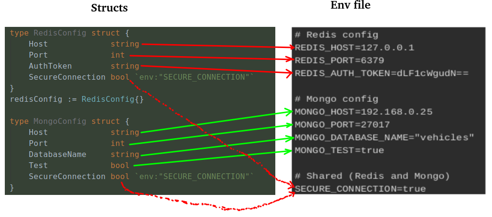

Allows you to load the system env into structures automatically  


example:

To use you must import the following:

```go
import "github.com/gojetpack/goconf"
```

Simple example:

In the following example you can see that there are two configuration structures:
- RedisConfig
- MongoConfig

All Redis environment variables will have the REDIS_ prefix in front. i.e: REDIS_HOST

All Mongo environment variables will have the MONGO_ prefix in front. i.e: MONGO_HOST 

You can associate an environment variable to a field as follows:

- Adding the "env" tag to the field, followed by the name of the environment variable. i.e:
```go    
    SecureConnection bool `env:"SECURE_CONNECTION"`
 ```
- By the field name. By default the field name is converted to "Screaming Snake Case" to match with the env var. 
i.e: SecureConnection -> SECURE_CONNECTION

The configuration structure is "ExtractorArgs"

```go
type ExtractorArgs struct {
	// Allow to configure the env extraction
	Options ExtractorOptions

	// It must be an even array of elements.
	// For each tuple:
	//  - The first element will be a pointer to the object in which the configuration will be saved.
	//  - The second element will be the prefix for this configuration
	Configs []interface{}
}
```

#### example 1

```go
type RedisConfig struct {
    Host             string
    Port             int
    AuthToken        string
    SecureConnection bool `env:"SECURE_CONNECTION"`
}
redisConfig := RedisConfig{}

type MongoConfig struct {
    Host             string
    Port             int
    DatabaseName     string
    Test             bool
    SecureConnection bool `env:"SECURE_CONNECTION"`
}
mongoConfig := MongoConfig{}


args := goconf.ExtractorArgs{
    Options: goconf.ExtractorOptions{
        EnvFile: "testdata/env_with_prefix", // env file path
    },
    Configs: []interface{}{
    //  Config struct | env name prefix
        &redisConfig, "REDIS",
        &mongoConfig, "MONGO",
    },
}
err := goconf.Extract(args)
```

Mapping



Prefix association


Result


-----


### support for command line arguments

By default, the arguments must be in snake case (CMDArgsNameCaseType option)

By default the precedence is as follows (EnvSourcePrecedence option)
- Os env
- ad

Examples of valid arguments:
- -boolean_flag -> parsed as "true"
- boolean_flag_without_dash -> parsed as "true"
- -this_is_an_arg_env=54321
- --this_is_an_arg_and_os_env=CMD


#### example 2

```go
os.Args = append(os.Args,
    "-boolean_flag",
    "boolean_flag_without_dash",
    "-this_is_an_arg_env=54321",
    "--this_is_an_arg_and_os_env=CMD",
)

type CustomAlias string

type ConfigExample struct {
    RegularConfigField       int         `env:"CRAZY_CONFIG_FIELD"`
    FieldWithoutTag          string      // linked to  "FIELD_WITHOUT_TAG" env var
    FieldWithChangedTag      bool        `env:"OTHER_CRAZY_NAME"`
    CustomAliasTypeField     CustomAlias `env:"CUSTOM_ALIAS_TYPE_FIELD"`
    BooleanFlag              bool
    BooleanFlagWithoutDash   bool
    ThisIsAnArgEnv           int
    ThisIsAnArgAndOsEnv      string
    IAmAnNonExistentVariable string
}

config := ConfigExample{}
args := ExtractorArgs{
    Options: ExtractorOptions{
        EnvFile:       "testdata/env_test",
        OmitNotTagged: false,
        EnvSourcePrecedence: []envSource{
            CMDArgs,
            OSEnv,
        },
    },
    Configs: []interface{}{&config, ""}, // Empty prefix
}
err := Extract(args)
if err != nil {
    fmt.Print(err)
    return
}
fmt.Print(config)
// Output: {1 Avengers: end game true Garfield: the mad cat true true 54321 CMD }
```
#### result
